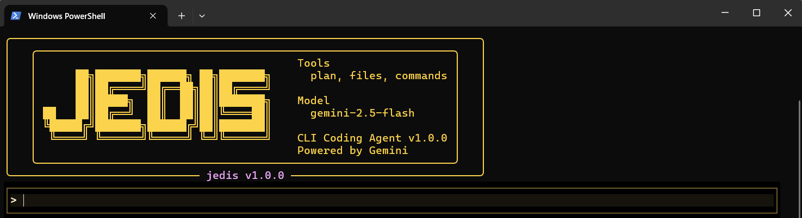
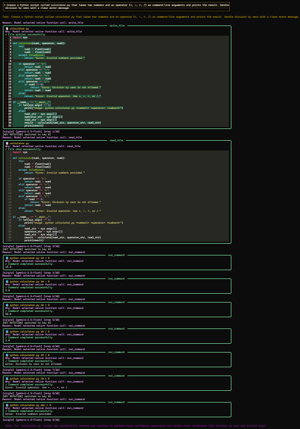
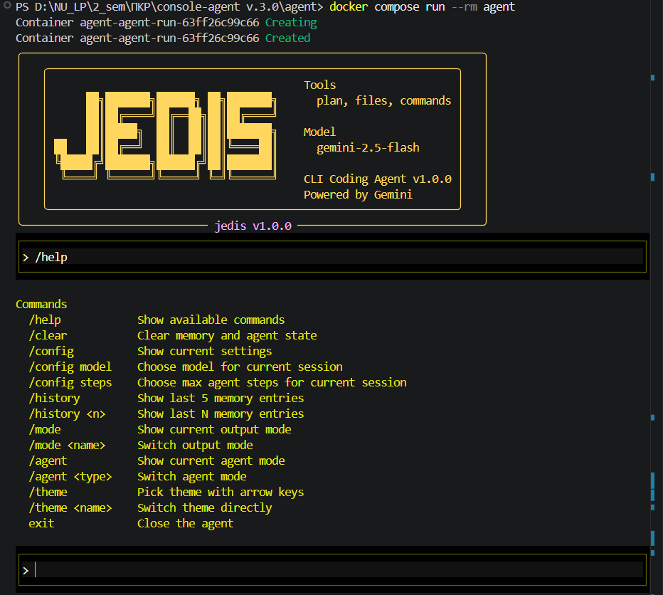

# JEDIS - Autonomous Multi-Agent CLI Coding System

JEDIS is an autonomous CLI coding agent powered by Google Gemini. It can inspect files, edit project code, run commands, and work through a task with minimal step-by-step guidance. The project supports a single-agent flow for straightforward tasks and a multi-agent flow for broader or multi-file work.

> [PLACEHOLDER: Insert a short 10-20 second demo GIF of the startup screen and one task run here]

## Table of Contents

- [Features](#features)
- [Architecture](#architecture)
- [Project Structure](#project-structure)
- [Requirements](#requirements)
- [Quick Start](#quick-start)
- [Docker Run](#docker-run)
- [Usage](#usage)
- [CLI Commands](#cli-commands)
- [Configuration](#configuration)
- [Persistence](#persistence)
- [Tests](#tests)
- [Demo Materials](#demo-materials)
- [Limitations](#limitations)

## Features

- Single-agent mode for focused coding tasks and quick local changes.
- Multi-agent mode with planner, coder, and reviewer stages for broader tasks.
- Auto routing that can choose between single and multi modes based on task complexity.
- Conversational mode for non-technical prompts.
- Gemini API key pool support through `GEMINI_API_KEYS`.
- Persistent local state through SQLite and JSON session files.
- Interactive terminal UI with themes and runtime configuration commands.
- Built-in filesystem and command safety restrictions scoped to the project root.

## Architecture

```text
User in terminal
    |
    v
main.py
    |
    +--> cli/router.py decides: single | multi | auto
    |
    +--> single --> AutonomousAgent --> Worker --> tools/*
    |                  |
    |                  +--> Evaluator
    |
    +--> multi --> OrchestratorAgent
                     |
                     +--> Planner
                     +--> Coder(s)
                     +--> Reviewer
                     +--> Repair loop if needed
```

The entry point is [main.py](D:/NU_LP/2_sem/ПКР/console-agent%20v.3.0/agent/main.py:1). Runtime state is persisted in SQLite under `.agent_memory/agent.db`, while session preferences are stored in `.agent_state/session.json`.

> [PLACEHOLDER: Insert an architecture diagram screenshot or exported schema image here]

## Project Structure

```text
.
|-- agents/                 # agent logic
|-- cli/                    # routing, command handling, pipeline
|-- schemas/                # pydantic models
|-- storage/                # sqlite models and repository layer
|-- tests/                  # pytest suite
|-- tools/                  # tool registry, filesystem tools, safety checks
|-- ui/                     # terminal UI rendering and input
|-- config.py               # environment-based settings
|-- main.py                 # entry point
|-- session.py              # persisted session preferences
|-- requirements.txt
|-- requirements-dev.txt
|-- Dockerfile
|-- docker-compose.yml
```

## Requirements

- Python 3.10+
- A Gemini API key
- Windows PowerShell, Terminal, or another terminal that handles interactive CLI input well

Optional:

- Docker Desktop for containerized execution

## Quick Start

Clone the repository and install dependencies:

```bash
git clone https://github.com/VladyslavStashenko/autonomous-multi-agent-system.git
cd autonomous-multi-agent-system

python -m venv .venv
```

Windows:

```powershell
.venv\Scripts\activate
pip install -r requirements.txt
Copy-Item .env.example .env
```

Linux/macOS:

```bash
source .venv/bin/activate
pip install -r requirements.txt
cp .env.example .env
```

Put your Gemini key into `.env`:

```env
GEMINI_API_KEYS=your_first_gemini_api_key,your_second_gemini_api_key
```

Run the app:

```bash
python main.py
```

## Docker Run

This project can also be run in Docker. That is useful when you want a reproducible environment or do not want to install Python dependencies locally.

Build and run:

```bash
docker compose build
docker compose run --rm agent
```

Or:

```bash
docker compose up --build
```

Notes:

- `.env` is loaded through `docker-compose.yml`.
- `.agent_memory` and `.agent_state` are mounted as volumes so local state survives container restarts.
- Docker is optional for this project. Local `venv` execution is also a perfectly valid way to run it.

> [PLACEHOLDER: Insert a terminal screenshot of `docker compose run --rm agent` working successfully]

## Usage

Start the CLI:

```bash
python main.py
```

On Windows you can also use:

```bat
jedis-agent-ap.bat
```

Type a task in Ukrainian or English. Depending on the selected mode, JEDIS will:

- answer conversational prompts in character
- run a single autonomous agent
- or route through the multi-agent pipeline

Important mode behavior:

- default saved mode can be `single`, `multi`, or `auto`
- automatic routing only happens when the selected mode is `auto`
- the application is a CLI tool, not a web app

## CLI Commands

| Command | Action |
|---|---|
| `/help` | Show all available commands |
| `/clear` | Clear memory, DB-backed history, and session state |
| `/config` | Show active runtime settings |
| `/config model` | Choose Gemini model for the current session |
| `/config steps` | Choose max step count |
| `/history` | Show recent task history |
| `/history <n>` | Show last `n` entries |
| `/mode` | Show or change output mode |
| `/agent` | Show or change agent mode |
| `/theme` | Show or change terminal theme |
| `exit` | Close the program |

> [PLACEHOLDER: Insert screenshot of `/theme` or `/config model` selection menu here]

## Configuration

Environment variables are loaded by [config.py](D:/NU_LP/2_sem/ПКР/console-agent%20v.3.0/agent/config.py:1).

| Variable | Description | Required |
|---|---|---|
| `GEMINI_API_KEYS` | One or more comma-separated Gemini API keys | Yes |
| `API_KEY` | Alternative single-key fallback | No |

Recommendations:

- Do not commit `.env`.
- Commit `.env.example`.
- If another person wants to test the project, they should use their own API key.

## Persistence

The project uses both JSON files and SQLite:

- `.agent_state/session.json` stores session preferences such as theme, selected mode, selected model, and step limit.
- `.agent_state/last_run.json` stores the latest run snapshot.
- `.agent_memory/memory.json` stores recent memory entries as a JSON copy/fallback.
- `.agent_memory/agent.db` is the main structured storage for runs, steps, and memory history.

This means SQLite is the primary structured persistence layer, while JSON files are used for session state and convenient local snapshots.

## Tests

Install dev dependencies:

```bash
pip install -r requirements-dev.txt
```

Run tests:

```bash
pytest
```

The repository includes tests for routing, storage, memory, CLI command handling, client pooling, and agent behavior.

## Demo Materials

Suggested assets to add:

1. Startup screen screenshot.
2. Single-agent task execution screenshot.
3. Multi-agent planner/coder/reviewer screenshot.
4. Docker run screenshot.
5. Optional short GIF showing one complete task from prompt to result.

Recommended folder layout:

```text
docs/
  screenshots/
    startup.png
    single-agent.png
    multi-agent.png
    docker-run.png
  demos/
    quick-demo.gif
```

Suggested embed block:

```markdown




```

## Limitations

- This is currently a terminal-first application, not a browser-based product.
- Other users should not receive your private Gemini API keys.
- Docker helps with reproducible setup, but it does not remove the need for a valid API key.
- Interactive CLI behavior may differ slightly across terminals.

## License

This project is licensed under the MIT License. See the LICENSE file for details.
